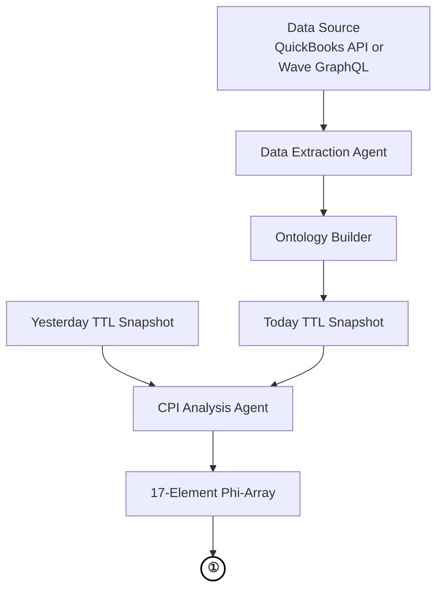
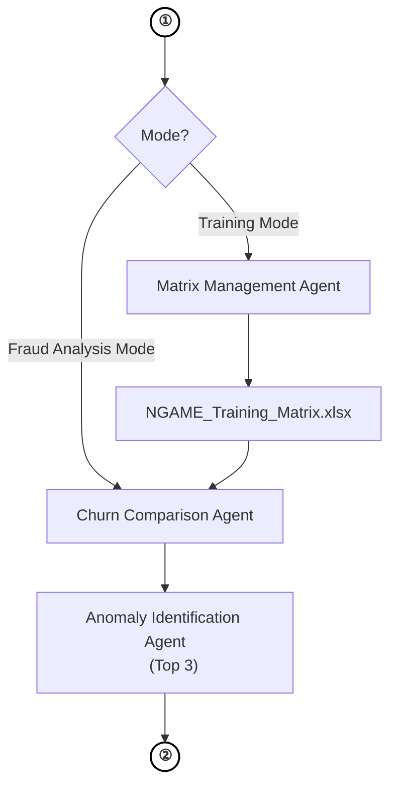
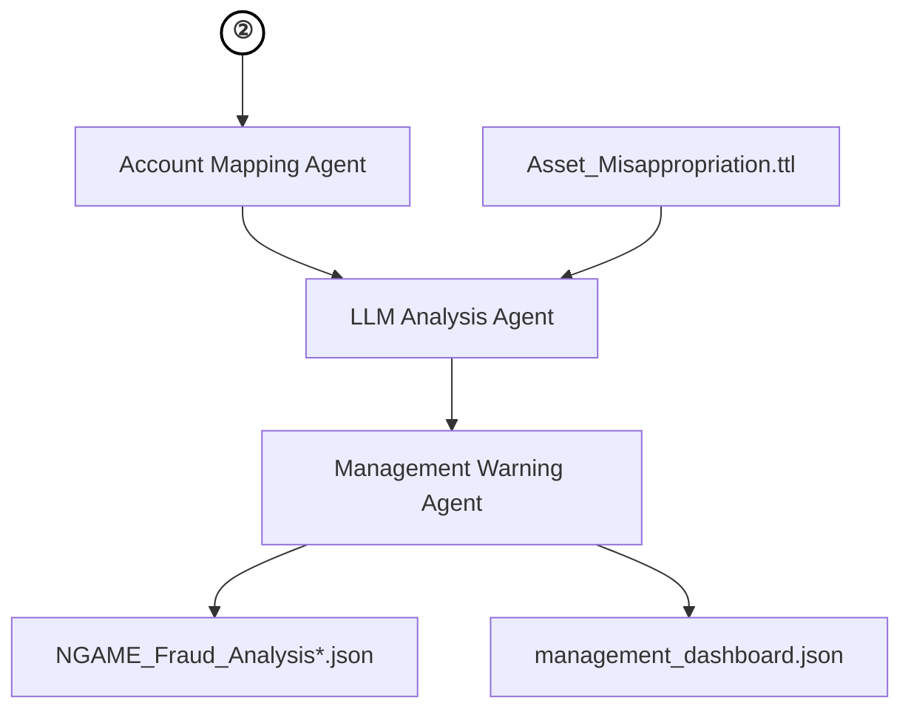

# NGAME Component Map — Print Version

> Three-part segmented diagram for print publication.
> Connector circles **①** and **②** link the pages: the same symbol that closes one page opens the next.

---

## Figure 1-a — Data Extraction & CPI Analysis

*Continues on Figure 1-b at connector ①*

---

## Figure 1-b — Mode Decision & Anomaly Identification

*Continues from Figure 1-a at connector ①  ·  Continues on Figure 1-c at connector ②*

---

## Figure 1-c — Risk Analysis & Warning Generation

*Continues from Figure 1-b at connector ②*
