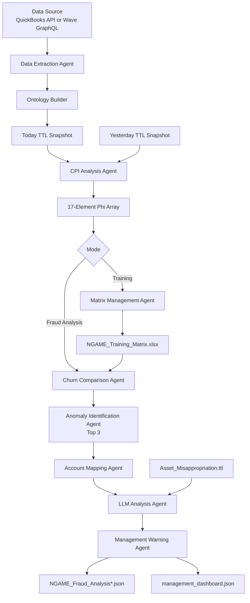
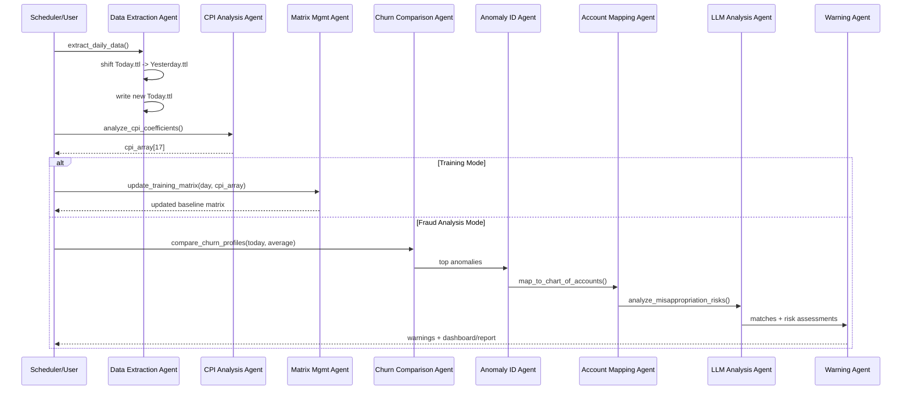

# NGAME

NGAME (Next-Generation Accounting Monitoring Engine) is a two-phase, agent-driven fraud analytics pipeline for accounting data.
It supports both **Training Mode** (build behavioral baseline) and **Fraud Analysis Mode** (detect deviations and generate management warnings).

---

## What NGAME Does

- Extracts daily accounting data (QuickBooks or Wave GraphQL)
- Builds semantic ontology snapshots (`*_Today.ttl`, `*_Yesterday.ttl`)
- Computes daily 17-element phi-array churn profile
- Builds/updates training baseline matrix (`NGAME_Training_Matrix.xlsx`)
- Detects top anomalies by deviation from baseline
- Maps anomalies to chart of accounts
- Runs LLM-based misappropriation risk analysis (Ollama)
- Produces management-facing warning artifacts

---

## High-Level Architecture

### Component Map



### Sequence (Daily Run)



---

## Repository Layout (Core Files)

- `ngame_training_flow_manager.py` - training orchestration
- `ngame_fraud_analysis_flow_manager.py` - fraud-analysis orchestration
- `ngame_dual_mode.py` - auto mode selection (training vs fraud analysis)
- `ngame_data_extraction_agent.py` - Phase I extraction + ontology
- `ngame_cpi_analysis_agent.py` - Phase II CPI analysis
- `ngame_matrix_management_agent.py` - training matrix updates
- `ngame_churn_comparison_agent.py` - baseline comparison
- `ngame_anomaly_identification_agent.py` - top anomaly selection
- `ngame_account_mapping_agent.py` - anomaly-to-account mapping
- `ngame_llm_analysis_agent.py` - Ollama/RAG risk analysis
- `ngame_management_warning_agent.py` - warnings/dashboard generation
- `run_training_flow.py` - training launcher
- `run_fraud_analysis.py` - fraud-analysis launcher
- `NGAME_WAVE_GRAPHQL_README.md` - Wave-specific setup details
- Web UI: see [ngame_ui/README.md](ngame_ui/README.md) for the Flask dashboard (run instructions and URLs).

---

## Prerequisites

- Python 3.10+
- `pip`
- QuickBooks config (`quickbooks_config.json`) or Wave config (`wave_config.json`)
- `Curated Transaction Types.ttl`
- `Asset_Misappropriation.ttl` (required for full fraud mode)
- Ollama at `http://localhost:11434` — required for fraud analysis mode (provides the generative AI reasoning layer)

---

## Installation and operations

| Document | Audience |
|----------|----------|
| **[INSTALL.md](INSTALL.md)** | Technical consultant — **start at “Windows surveillance PC — trial install”** for new Windows sites; full install, handoff |
| **[FRP_OPERATIONS_GUIDE.md](FRP_OPERATIONS_GUIDE.md)** / **[FRP_OPERATIONS_GUIDE.html](FRP_OPERATIONS_GUIDE.html)** | Financially Responsible Person — **dashboard only** (print/PDF from HTML) |
| **[docs/archive/](docs/archive/)** | Historical guides only — do not use for new deployments |

> The FRP runs daily training and fraud checks from the web dashboard (**Run Training Day** / **Run Churn Analysis**). The consultant installs NGAME, keeps the dashboard service running, and gives the FRP the operations guide plus a browser bookmark.

---

## Configuration

### Wave GraphQL

```bash
cp wave_config.example.json wave_config.json
```

```json
{
  "wave_graphql": {
    "endpoint": "https://gql.waveapps.com/graphql/public",
    "access_token": "YOUR_WAVE_ACCESS_TOKEN",
    "business_id": "YOUR_BUSINESS_ID"
  }
}
```

---

## Running NGAME

### Training Mode

```bash
python3 run_training_flow.py
```

### Fraud Analysis Mode

```bash
python3 run_fraud_analysis.py
```

### Dual Auto-Mode

```bash
python3 ngame_dual_mode.py
```

---

## Data Artifacts

- `quickbooks_ontology_Today.ttl` / `quickbooks_ontology_Yesterday.ttl`
- `wave_ontology_Today.ttl` / `wave_ontology_Yesterday.ttl` (Wave source)
- `NGAME_Training_Matrix.xlsx`
- `NGAME_Fraud_Analysis.json`
- `NGAME_Fraud_Analysis_readable.json`
- `NGAME_Fraud_Analysis_readable_clean.json`
- `NGAME_Fraud_Analysis_readable_truly_clean.json`
- `management_dashboard.json`

---

## Maintenance Notes

- Keep transaction-type ordering consistent across all agents (17-element phi array).
- Validate TTL files before downstream analysis.
- Avoid runtime dependency installation in production; prefer pinned dependencies.
- Monitor LLM availability and output quality drift.

---

## Known Risks / Caveats

- Mixed 0-based/1-based indexing appears in some anomaly flows.
- `ngame_cpi_analysis_agent.py` currently references QuickBooks TTL filenames; Wave-mode Phase II should be validated.
- LLM stage depends on local Ollama service availability.
- OAuth uses Intuit’s Accounting scope; read-only behavior is enforced by NGAME code, not by a separate read-only OAuth scope.

---

## Security and Compliance

**NGAME and QuickBooks Online.** NGAME is read-only surveillance: the shipped pipeline only queries QuickBooks and saves results on the surveillance computer (ontology files, training matrices, reports). It does not post, edit, void, or delete QBO records. Bookkeepers change the live books through QuickBooks itself; NGAME reads the same cloud data via Intuit’s API.

**What is true.** It is true that unmodified NGAME cannot alter the organization’s QuickBooks ledger. It is not true that stolen API credentials are harmless: valid tokens on the surveillance machine allow read access (and possibly writes through other tools, depending on how OAuth was authorized). Credentials belong only on the surveillance computer; the QuickBooks Audit Log remains the control for book changes and for training-period integrity.

- Do not share live tokens or secrets.
- Keep credential files out of any document management system (GitHub, SharePoint, Google Drive, email attachments, and similar).
- Archive run artifacts for auditability—for example, `NGAME_Fraud_Analysis.json`, `quickbooks_ontology_Today.ttl`, and `NGAME_Training_Matrix.xlsx`.

