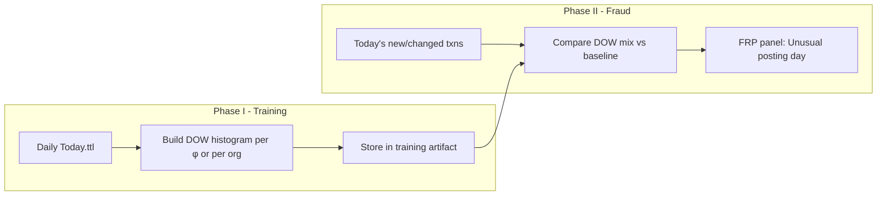

# NGAME enhancements and mutation tracking
_Exported on 6/4/2026 at 14:18:36 PDT from Cursor (3.6.31)_

---

**User**

Enhancements to NGAME. Writing partner, also an experienced auditor, suggests possible enhancments that would immediately attract new adopters. First, how feasible to add MUTATION tracking, i.e. compare churn of lowest-levl attributes like addresses, contact info and other parts of QBO records? Mutation might then be folded under CPI, or possibly reported to the FRP in a separate reporting window. Do NOT even begin to do any code refactoring.

---

**Cursor**

Analyzing feasibility of mutation tracking against the current NGAME architecture—exploring CPI, QBO extraction, and FRP reporting without changing code.


## Executive summary

**Mutation tracking is already partially built** in NGAME under the name **property mutations** — a day-over-day field diff on records that share the same QuickBooks ID. It is **not** the same as CPI (Jaccard on IDs), and it is **not yet** what adopters see on the Phase II dashboard or in z-score alarms. Extending it to addresses, richer contact data, and other “lowest-level” attributes is **feasible and aligned with auditor expectations**, with a clear path: wire what exists, then widen what gets extracted, then optionally add baselines — without folding mutation into CPI as a single number.

---

## What NGAME already does (conceptually)

The pipeline already runs **three parallel readers** on the same nightly snapshots (documented in `NGAME_Churn_Walkthrough.md`):

| Check | Question | What moves |
|-------|----------|------------|
| **CPI** | Which **record IDs** were added, removed, or kept? | Identity / “attendance” |
| **wCPI** | When IDs churn, were **dollars** unusually large? | Dollar-weighted identity churn |
| **Property mutations** | For IDs in **both** days, did any **field** change? | Attribute churn on stable IDs |

Implementation lives in `ngame_cpi_analysis_agent.py`: for each transaction type, URIs present in both `Yesterday.ttl` and `Today.ttl` are compared property-by-property (added / removed / modified). That is exactly the auditor’s “mutation” idea, scoped to whatever fields were written into the ontology.

**Important limitation today:** the fraud flow uses CPI arrays for comparison, ranking, LLM narrative, and dashboard — **not** `property_mutations`. The churn comparison agent has no mutation hooks; the dashboard guide still sends FRPs to the QBO Audit Log for line edits on the same invoice ID. Backlog items **A3** (instrument in detection) and **A4** (FRP panel) capture this gap explicitly.

---

## Feasibility: three layers of work

### 1. Surface existing mutations (high feasibility, high adopter value)

The diff engine already runs inside `analyze_cpi_coefficients()`. Making mutations visible to FRPs is mostly **integration and UX** (fraud JSON, dashboard section, optional LLM context) — not a new analytical model. That directly closes the documented gap: *“Invoices CPI = 1.0 but someone changed the amount on #1039.”*

**Effort:** low–medium. **Risk:** low. **Auditor story:** immediate — “NGAME catches silent edits CPI misses.”

### 2. Expand *which* attributes are tracked (medium feasibility)

Ontology construction today maps a **fixed subset** of QBO fields into TTL, for example name, company, email, phone, active, amounts, dates, doc numbers — but **not** structured addresses (`BillAddr`, `ShipAddr`, etc.), bank/payment details, tax IDs, or line-level invoice rows. There are no address-related predicates in the Python extraction path.

| Attribute class | Feasibility | Notes |
|-----------------|-------------|-------|
| Email, phone, name, company | **Already in path** | Sometimes stored as stringified dicts from QBO; diffs work but presentation may be noisy |
| Invoice/bill **amounts**, dates, doc # | **Already in path** | Strong fraud signal (your walkthrough example) |
| **Addresses** (vendor/customer) | **Medium** | QBO exposes nested address objects; need stable serialization (one canonical string or normalized sub-properties) so benign formatting does not flood false positives |
| Bank / ACH / payment routing | **Medium–high value, medium effort** | High auditor interest; may be sparse in sandbox; privacy sensitivity in reports |
| Invoice **line items** | **Harder** | Line IDs and counts change; needs line-keyed diff, not flat property compare |
| **Who** changed a record | **Separate track** | QBO Audit Log / different API — backlog **C1**; not mutation-from-snapshots |

Extraction is a **full daily pull** per entity type (`Class.all()`), not Intuit CDC. Mutation detection therefore stays **snapshot diff (Y vs T)** — which is appropriate and does not require a new ingestion paradigm.

**Effort:** medium per attribute family (ontology mapping + normalization rules). **Risk:** false positives from API representation drift unless normalization is careful.

### 3. Statistical “mutation churn” baselines (medium–high effort, optional for v1)

CPI learns μ/σ over 30 training days per φ dimension. Mutations today have **no training baseline** — they are listed when seen, not scored as “unusual for this org.”

To mirror CPI you would need, per transaction type (or per property family):

- Daily **mutation rate** (e.g. count of mutated records / count of retained records)
- Or **severity-weighted** mutations (amount delta, bank-field change = higher weight)
- 30-day baseline → z-score or HIGH/MEDIUM/LOW band

**Effort:** medium–high (training matrix schema, comparison agent, threshold calibration per backlog **A5**). **Risk:** stable orgs may have near-zero mutation baselines → small edits spike; noisy orgs need tuning.

---

## Fold under CPI vs separate FRP window?

**Recommendation: keep mutation analytically separate; present it as a fourth parallel check (or dedicated panel), not a merged CPI.**

| Approach | Verdict | Why |
|----------|---------|-----|
| **Fold into CPI (one number)** | **Not recommended** | CPI is Jaccard on **URI sets**. Same ID with changed amount = **retained** → CPI stays high. Merging would either distort CPI semantics or hide the edit signal auditors care about. |
| **Parallel “mutation index” per φ** | **Good** | e.g. `M_k = mutated_retained / retained` per type; comparable across days; can feed z-scores later (backlog A3). |
| **Separate FRP reporting window** | **Best for adoption** | Matches how you already teach “three checks”; mutations are **supplementary** in SME docs — ideal as **“Field changes (same record ID)”** with drill-down: entity, field, yesterday → today. |
| **Sequence / slow-burn** | **Optional phase 2** | Rolling buffer today stores CPI/wCPI only — sustained **address hopping** on one vendor could use a multi-day mutation buffer analogous to SCPI. |

For an experienced auditor, a **separate panel** is clearer than a blended score: structural churn (CPI) vs **in-place tampering** (mutations) vs **who did it** (Audit Log, future C1).

---

## Adopter appeal (why your partner is right)

1. **Closes the #1 skeptic objection** to Jaccard-only monitoring: “They only changed the amount; nothing flagged.”
2. **Already in training narrative** (`NGAME_Churn_Walkthrough`, lab docs) — product story can lead with it once surfaced.
3. **Read-only QBO** — still observational; no write access required.
4. **Complements, not replaces, Audit Log** — NGAME flags *what* changed on master data/transactions; FRP still uses QBO for *who* and workflow context (until C1).

---

## Practical rollout sequence (no code, planning only)

1. **Wire & surface** existing property mutations to Phase II output and dashboard (closes A4 narrative gap fastest).
2. **Normalize & extend** ontology fields: addresses, tax ID, key vendor/customer payment fields; document “mutation classes” for FRP (payment redirect vs cosmetic address typo).
3. **Optional scoring**: mutation-rate φ dimensions + training baseline (A3); keep separate from CPI z-scores initially.
4. **Later**: multi-day mutation persistence; Audit Log attribution (C1).

---

## Bottom line for your writing partner

| Question | Answer |
|----------|--------|
| Is mutation tracking feasible? | **Yes** — core diff exists; gaps are coverage, baselines, and FRP surfacing. |
| Compare churn of addresses, contact info, etc.? | **Yes, with extraction + normalization work**; contact-ish fields partly there; **addresses not yet**. |
| Fold under CPI? | **No** for semantics; **yes** as sibling metric in the same daily run. |
| Separate FRP window? | **Strong yes** — best fit for auditor mental model and current docs. |
| Immediate adopter hook? | **Surface Check C** before building full mutation z-scores. |

I have not changed any code, per your instruction. If you want a one-pager for the partner (manuscript / proposal language), say whether it should target **nonprofit FRPs** or **journal / DSRM** tone.

---

**User**

Enhancement #2. Use case: the accountant normally does certain transactions on certain days of the week. Acting nefariously, the account might perform those transactions on other days (i.e. Saturday or Sunday). Catching and reporting this anomalous behavior as part of the CPI (or reporting it directly to the FRP would be a desirable early warning to the FRP and an attractive adoptor's and auditor's feature. How much software debt does it incur to include caendar day (Mon-Sun)  among the attributes of the transaction?

---

**Cursor**

Analyzing how transaction dates flow through extraction and CPI to estimate effort and architectural fit for day-of-week anomaly detection.


## Short answer

**Storing calendar day (Mon–Sun) as a transaction attribute is low debt** — in many cases **zero extra storage**, because `hasTransactionDate` is already written to the ontology and day-of-week is trivial to derive at analysis time.

**Detecting “this org usually posts Bills on Tuesday but today’s run shows Saturday Bills” is a separate, medium-to-high debt feature** — closer to a new parallel check (like Credit Card Watch) than to CPI. Folding it into CPI would add **conceptual debt** without matching how CPI is defined today.

---

## What the use case actually needs

Your partner is describing **organizational rhythm profiling**, not record-ID churn:

| Question | Right tool | CPI today? |
|----------|------------|------------|
| Did we gain/lose **record IDs** overnight? | CPI (Jaccard) | Yes |
| Did someone **edit** an existing record’s fields? | Property mutations | Partially built |
| Did activity happen on an **unusual day of week** for this org? | Temporal / calendar pattern | **No** |

A bookkeeper who normally enters bills Mon–Fri but posts on **Saturday** usually creates **new** transactions with **Saturday `TxnDate`** (or back-dated dates — see caveat below). That does **not** lower CPI if the same IDs are “retained” or if Saturday’s work is all **Added** IDs that look like normal vendor churn. CPI never inspects **when** work happened, only **which IDs** appeared or disappeared.

So the attractive auditor story is valid; the implementation path is **not** “add DOW to CPI,” but **“learn day-of-week mix during Phase I, flag deviations in Phase II.”**

---

## Software debt: adding calendar day as an attribute

### Already in the pipeline

`TxnDate` is already mapped to `qb:hasTransactionDate` when building `Today.ttl` / `Yesterday.ttl` (invoices, bills, payments, expenses, time activities, etc.). Anything with that predicate already carries an ISO date.

**Deriving Mon–Sun at read time** (from `hasTransactionDate`) costs almost nothing: no schema explosion, no second nightly diff dimension, no change to the 18-element φ vector **by itself**.

| Approach | Software debt | Notes |
|----------|---------------|--------|
| **Derive DOW in analyzers only** | **Very low** (~trivial logic wherever you score) | Preferred; single source of truth |
| **Persist `qb:hasDayOfWeek` in TTL** | **Low** (ontology writer + property definition; mirror in `phase1_director_agent.py` if still used) | Redundant with date; useful only if you want explicit OWL/rules on literals |
| **Treat DOW as property mutation** | **Low code, wrong semantics** | Only fires if `TxnDate` **changes** on same ID; misses “new Saturday bill” |
| **Fold into CPI / φₖ** | **High conceptual debt** | CPI = set overlap on URIs, not calendar histogram |

**Rough touch surface for “attribute only”:** extraction/ontology generation (1–2 files), optional glossary/SME doc line, optional mutation noise if you store both date and DOW and they drift.

**Not all 18 φ types have a transaction date.** Vendors, customers, chart-of-accounts rows, products, employees, etc. are master data — day-of-week on those records is usually meaningless. Calendar logic applies to **transaction-shaped** types (Bills, Bill_Payments, Invoices, Expenses, Time_Activities, …), not the full 18-vector uniformly.

---

## What already exists (narrow precedent)

`ngame_credit_card_watch_agent.py` already flags **weekend charges to personal-category vendors** (Saturday/Sunday via `weekday() >= 5`), scoped to HIGH/CRITICAL vendor classes to limit noise.

That is **not** org-specific training (“we never post bills on Sunday”) and **not** general ledger rhythm across Bills/Payments/etc. It shows the pipeline can host a **fourth parallel reader** without touching CPI math — the right pattern for Enhancement #2 at full strength.

`anomaly_detection_config.json` describes `temporal_anomaly` / weekly patterns, but **nothing in the main Python fraud path references it** — config debt only, not wired behavior.

`anonymization_config.json` already has `preserve_weekday: true` for date shifting in synthetic runs — a hint that DOW was considered for **pattern preservation**, not production detection yet.

---

## Debt to deliver the *auditor-facing* feature (not just the attribute)

To match the partner’s story (“normally Tuesday, alarm on Saturday”), you need **baseline + compare**, not a new TTL field alone.



| Layer | Effort | Debt type |
|-------|--------|-----------|
| Derive DOW from existing dates | Trivial | None structural |
| Per-type **weekend / off-day ratio** in training matrix or sidecar JSON | Medium | New columns or parallel buffer (like `NGAME_CPI_Rolling_Buffer.json`) |
| Z-score or HIGH/MEDIUM bands vs 30-day rhythm | Medium | Same family as wCPI / mutation baselines (backlog A3/A5) |
| FRP dashboard section | Medium | UI + fraud JSON wiring (dashboard still has no mutation panel either) |
| Fold into CPI φ array | **Not recommended** | Would blur Layer 1 “structural churn” with calendar behavior |

**Ballpark:** attribute-only **days**; full org-learned calendar anomaly **weeks** (design + calibration + false-positive tuning), assuming you reuse CC-watch / fraud-flow patterns rather than redesigning the matrix.

---

## Critical QBO semantics (auditor must understand)

NGAME snapshots **`TxnDate`** on the document (bill date, invoice date), **not** “when the user clicked Save in QBO.”

| Scenario | DOW on `TxnDate` | What FRP still needs |
|----------|------------------|----------------------|
| Saturday entry with **Saturday** bill date | Detectable | NGAME |
| Saturday entry with **Friday** backdated date | **Missed** | QBO **Audit Log** (entry timestamp / user) — backlog **C1** |
| Legitimate month-end accrual | Possible false positive | FRP judgment + baseline tuning |

For “nefarious posting on weekends,” **`MetaData.CreateTime` / LastUpdatedTime** from QBO would be closer to “when work was done” but is **not extracted today** — that would be **additional API field debt**, not just Mon–Sun on `TxnDate`.

---

## CPI vs direct FRP reporting (recommendation)

| Option | Verdict |
|--------|---------|
| **Inside CPI (18 φ)** | Poor fit; conflates ID churn with calendar rhythm |
| **Parallel “Posting calendar” check** | Best fit; matches “three checks” + CC Watch model |
| **Supplementary FRP panel** | High adopter/auditor value; same tier as property mutations |

Marketing line: *“NGAME learns which days of the week you normally post each category of activity — and flags when today’s pattern doesn’t match.”*

---

## Bottom line on software debt

| Scope | Debt |
|-------|------|
| **Calendar day as derivable attribute** | **Minimal** — date already there; DOW is one function call |
| **Persist `hasDayOfWeek` in ontology** | **Low** — small, mostly redundant |
| **Org-specific “unusual posting day” early warning** | **Medium** — new baseline store, comparator, FRP surfacing; **do not** bolt onto CPI without a new metric |
| **Entry-time / who posted** | **Separate, higher** — Audit Log / metadata, not solved by DOW alone |

**Practical sequence:** derive DOW from `hasTransactionDate` → build weekend/off-day **mix per transaction type** during Phase I → flag in Phase II as a **fifth dashboard section** (or extend CC-watch pattern to all dated types with trained baselines). That delivers the partner’s feature without inflating CPI’s 18-element Jaccard semantics.

I have not changed any code. If useful next, a one-page “Posting calendar vs CPI vs Audit Log” table for the manuscript or partnership deck would slot cleanly next to `NGAME_Churn_Walkthrough.md`.

---

**User**

Feature #3 (contemplated only): already covered generally by CPI (and Jaccard), but Market would find it attractive for NGAME to report on a pattern of DELETED TRANSACTONS, a frequent indicated of fraud. The report of this pattern might specific statistics on this (mal)practice. And again, might this not be another separate report on the Dashboard. Rrelated more general question: might the reporting of these specific "mis-use cases" best be presented on a single list within a "Notable Suspicious Activity"?

---

**Cursor**

Reviewing how deletions are represented in CPI and what the dashboard already surfaces for fraud reporting.


## Feature #3: Deleted transactions — already in the math, not yet in the market story

Your partner is right that **deletion is a classic fraud indicator**, and NGAME **already measures it** in Layer 1 (structural churn). What is missing is **market-facing, deletion-specific reporting** — counts, dollars, and identifiable records — not a new detection primitive.

### What CPI / Jaccard already captures

For each transaction type *k*, overnight comparison partitions yesterday’s URIs (Y) and today’s (T):

| Symbol | Glossary term | Meaning |
|:------:|---------------|---------|
| *b* | **Removed** | In Y but not in T — deleted, voided, or otherwise gone from the snapshot |
| δ | **Deletion rate** | δ = *b* / *n* where *n* = retained + added + removed |
| CPI | Jaccard | Low CPI when *b* (and/or *c*) is large |

The CPI agent also computes **`deletion_rate_array`** (18 elements), **`w_deletion_rate`** (dollar-weighted removed amounts), and per-type counts `removed: b` inside `cpi_coefficients`. Churn comparison’s z-score on **CPI** treats a **large negative *z*** as “more churn than usual,” with explicit fraud emphasis on **mass deletion** in `NGAME_Churn_Z_Score_Derivation.md` and the churn comparison agent.

So Feature #3 is **not a new detector** at the statistical layer — it is **re-framing and drill-down** on the **Removed** cell of the Jaccard table.

### What the FRP does *not* get today

| Gap | Why it matters for marketing / auditors |
|-----|----------------------------------------|
| **No deletion manifest** | Set difference Y \ T is computed as a **count** only; **which** invoice/bill IDs vanished is not persisted in fraud JSON or the dashboard. |
| **δ not first-class in alerts** | Top Anomalies rank on **CPI *z***, not “unusual **deletion rate** today.” A day of heavy deletes mixed with adds can look ambiguous. |
| **No deletion-only statistics block** | Market wants: “**3** invoices removed overnight (**$42,100** removed value); org baseline: **0.2** deletions/day on Invoices.” |
| **Void vs delete ambiguity** | QBO snapshot “gone” = removed from Today.ttl; NGAME does not label void vs hard delete (Audit Log still authoritative). |

**Contemplated enhancement (low–medium debt):** after CPI run, emit a **Deletion Activity** artifact: per φ type — `removed_count`, `removed_dollar_total` (from yesterday properties), optional list of doc # / amount / type; compare δ to training baseline (μ_δ, σ_δ) if you store deletion_rate arrays in the matrix. **No change to Jaccard definition required.**

---

## Separate dashboard card vs folding into CPI?

| Approach | Fit |
|----------|-----|
| **Fold into CPI only** | Technically already there; **weak for adopters** — FRP sees “Invoices HIGH,” not “deletion pattern.” |
| **Dedicated “Deletion / suppression activity” panel** | **Strong for market** — speaks auditor language; can show δ, *b*, $ removed, trend vs 30-day norm. |
| **δ-based z-score parallel to CPI *z*** | Medium effort; surfaces delete-heavy days even when adds muddy CPI. |

Recommendation: **yes, a separate report section** (or a tagged subsection), even though CPI already “covers” it — same rationale as property mutations and posting-calendar: **same pipeline, different question, different FRP sentence.**

---

## “Notable Suspicious Activity” — one list for all misuse cases?

Features discussed across this thread share a pattern:

| Mis-use case | Detection layer | FRP question |
|--------------|-----------------|--------------|
| Mass / unusual **deletions** | δ, *b*, CPI ↓ | “What disappeared?” |
| **Field edits** on same ID | Property mutations | “What was tampered in place?” |
| **Off-calendar** posting | DOW vs baseline (contemplated) | “Why Saturday bills?” |
| **CC misuse** | CC Watch (live) | “Personal vendor / weekend charge?” |
| **Slow-burn churn** | Multi-Day / SCPI | “Sustained drift?” |
| **Category churn** | Top Anomalies (CPI *z*) | “Which bucket is unstable?” |

Today the dashboard spreads these across **Management Warnings**, **Top Anomalies**, **Dollar-Weighted Alerts**, **Multi-Day**, and **Credit Card Watch** — with documented gaps (mutations, line edits, who changed what).

### Unified “Notable Suspicious Activity” (NSA) — recommended shape

A **single triage list** is a strong product and auditor UX move **if** it is implemented as an **aggregator**, not a replacement for specialist panels:

```
Notable Suspicious Activity (today)
├── [HIGH] Deletion pattern — Invoices: 4 removed ($18,200) vs baseline δ≈0
├── [HIGH] Field change — Invoice #1039 amount $1,200 → $12,000
├── [MED]  Off-calendar — Bills: 60% of today's new activity on Saturday
├── [MED]  Category churn — Vendors z=−3.2 (CPI unusually low)
└── [LOW]  CC Watch — weekend charge, personal-category vendor
```

**Each row should carry:**

- **Signal kind** (deletion | mutation | calendar | structural | cc | sequence) — so auditors know *which* playbook to use  
- **Severity** (HIGH / MEDIUM / LOW) — harmonized rules per channel  
- **Plain-language one-liner** — no φ index jargon for FRP  
- **Drill-down** — expand to specialist card or technical detail  
- **Explicit non-verdict** — “notable for review,” not “fraud confirmed” (glossary Layer 3)

**Why aggregate:**

- FRP Phase II checklist already asks them to scan **multiple** sections; one inbox reduces skip risk.  
- Marketing: one branded deliverable — *“NGAME Notable Suspicious Activity — [date]”*  
- Manuscript / DSRM: Layer 3 **triage** artifact with typed findings, separate from Layer 1 notation (*a*, *b*, *c*).

**Why keep specialist cards:**

- **Credit Card Watch** and **Multi-Day** need context (vendor class, window *L*) that does not compress to one line well.  
- **Top Anomalies** remains the **structural** home for φ-ranked CPI; NSA **pulls from** it, does not duplicate the full table.  
- **Overall Risk** can stay summary-level (backlog C2: incorporate slow-burn); NSA feeds it rather than replacing it.

**Caution:** a single list needs a **stable ranking policy** (e.g. HIGH deletions with dollar mass above MEDIUM calendar quirks). Heterogeneous signals should not compete on one number without a documented priority order.

---

## Suggested information architecture (contemplated only)

| Tier | UI element | Audience |
|------|------------|----------|
| **1 — Summary** | Overall Risk + warning count | FRP 10-second scan |
| **2 — Triage** | **Notable Suspicious Activity** (unified, typed list) | FRP daily worklist |
| **3 — Depth** | Specialist cards: Top Anomalies, Multi-Day, CC Watch, *(future)* Deletions, Mutations, Posting calendar | Drill-down / training / audit |

Deletion-specific **statistics** belong in Tier 2–3: aggregate stats in the deletion row; optional “Deletion detail” card with tables (count, δ, $ removed, 30-day comparison).

---

## Bottom line

| Question | Answer |
|----------|--------|
| Is deletion already covered by CPI/Jaccard? | **Yes** — **Removed** (*b*) and δ are first-class in the math; low CPI and negative *z* already imply delete-heavy nights. |
| Is it attractive to report explicitly? | **Yes** — market and auditors want **named, quantified deletion behavior**, not only “Invoices unusual.” |
| Separate dashboard report? | **Yes** — or a **deletion-tagged** block inside NSA; low incremental debt if you persist Y \ T manifests and surface existing δ / w_deletion arrays. |
| Single “Notable Suspicious Activity” list? | **Best presentation model for misuse cases** — **aggregator over parallel readers**, with specialist cards retained for depth; aligns with Layer 3 triage and reduces FRP scatter across five panels. |

No code was changed. A short “NSA row types” table for the partnership deck or `NGAME_FRP_PhaseII_Dashboard_Guide.md` would be a natural next documentation step if you want that committed to the repo.

